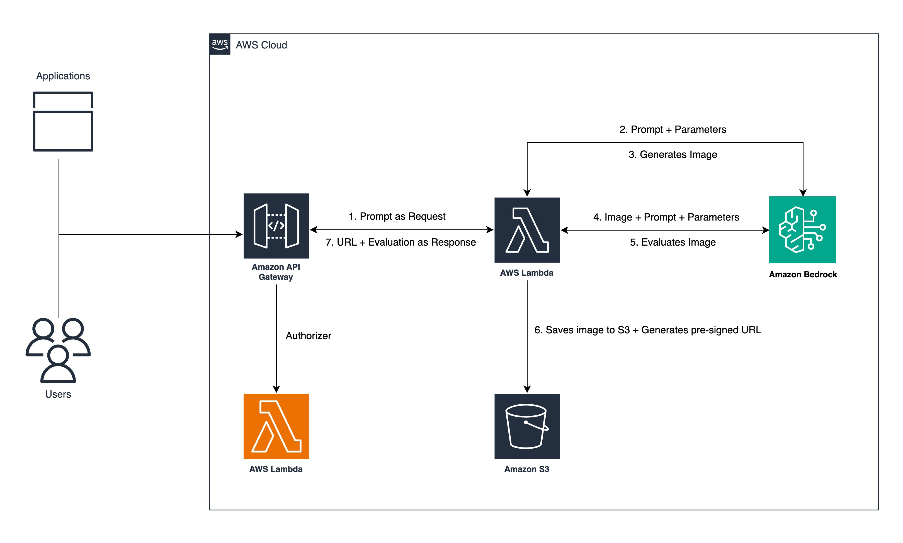

# Blog Description
[Generate and evaluate images in Amazon Bedrock with Amazon Titan Image Generator G1 v2 and Anthropic Claude 3.5 Sonnet](https://aws.amazon.com/blogs/machine-learning/generate-and-evaluate-images-in-amazon-bedrock-with-amazon-titan-image-generator-g1-v2-and-anthropic-claude-3-5-sonnet/)



# Requirements
### Prerequisites for Using Amazon Bedrock with Boto3

- An **AWS account** to create and manage the necessary AWS resources.
- **Amazon Nova Canvas** enabled on Amazon Bedrock.
- **Anthropic Claude 3.5 Sonnet** models enabled on Amazon Bedrock in **AWS Region us-east-1**.

# Steps/Actions

You can build the solution architecture using **AWS CloudFormation**. A single YAML file contains the infrastructure, including **AWS Identity and Access Management (IAM) users, policies, API methods, the S3 bucket, and the Lambda function code**.  

## **Deploy the CloudFormation Stack**
1. **Sign in** to the AWS Management Console as an IAM administrator or an appropriate IAM user.  
2. Choose **Launch Stack** to deploy the CloudFormation template.  
3. Choose **Next**.  
4. In the **Parameters** section, enter the following:
   - A **name** for the new S3 bucket that will receive the images (e.g., `image-gen-your-initials`).  
   - The **name** of an existing S3 bucket where access logs will be stored.  
   - A **token** to authenticate your API (a string of your choice).  
5. Choose **Next**.  
6. Choose **Next** again.  
7. Acknowledge the **creation of IAM resources** and choose **Submit**.  
8. When the stack status is **CREATE_COMPLETE**, navigate to the **Outputs** tab and find the API information.  
9. **Copy** the `ApiId`, `ApiUrl`, and `ResourceId` to a safe place for testing.  

## **Test the Solution Using the AWS Console**
1. Open the **API Gateway Console**.  
2. Choose **APIs** in the navigation pane.  
3. In the **APIs list**, select **BedrockImageGenEval**.  
4. In the **Resources** section, select the `POST` method below `/generate-image`.  
5. Choose the **Test** tab in the method execution settings.  
6. In the **Request body** section, enter the following JSON structure:  

   ```json
   {
     "prompt": "your prompt"
   }

## OUTPUT
Output is stored in S3 bucket.

